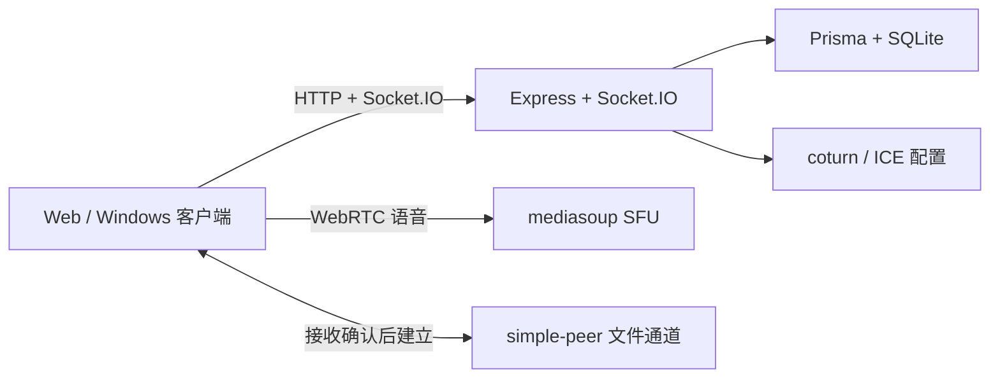

<div align="center">
  

  # JinVoice

  **为游戏开黑打造的轻量、自托管实时语音房间**

  无需复杂账号流程，几秒加入房间；在网页或 Windows 桌面端获得低延迟语音、可靠的麦克风状态和完整的房间协作能力。

  [English](README_EN.md) · 简体中文

  [](https://github.com/JinSheng-oam/jin-voice/actions/workflows/ci.yml)
  [](LICENSE)
  [](package.json)
  [](https://mediasoup.org/)
</div>

> [!IMPORTANT]
> JinVoice 仍在持续开发中。公网部署前请配置 HTTPS、TURN、可信来源和独立管理员凭据。

## 为什么选择 JinVoice

- **低延迟多人语音** — 所有房间语音统一通过 mediasoup SFU 转发，适合游戏小队和小型社区。
- **先确认，再开麦** — 入房前检查设备和静音状态；入房后持续显示真实发送状态、输入电平与连接质量。
- **完整音频工具箱** — 支持标准降噪、RNNoise AI 降噪、原始输入、语音感应、按键说话、耳返及成员独立音量。
- **轻量房间协作** — 游客可直接加入，也支持账号、密码房间、邀请链接、房主管理、公共/私聊和图片消息。
- **按需建立文件连接** — 接收方确认后才建立 simple-peer 数据通道；语音始终使用 SFU，不与文件传输混用。
- **真正可自托管** — Web、Windows 桌面端、Docker、SQLite、TURN 和自动化部署均包含在同一仓库。

## 核心能力

| 语音与设备 | 房间与协作 | 外观与运维 |
| --- | --- | --- |
| 多人 SFU 语音 | 公共、密码与锁定房间 | 深色 / 浅色主题 |
| 三种降噪模式 | 游客、账号与邀请链接 | 图片 / 视频背景媒体库 |
| VAD 自动校准 | 公共及私密图文聊天 | 面板透明、模糊与光影 |
| 全局按键说话 | P2P 文件邀请与传输 | 健康检查与诊断导出 |
| 耳返与输出测试 | 房主和管理员控制 | Docker 与 Windows 客户端 |

## 快速开始

### 环境要求

- Node.js 20 或 22 LTS
- npm
- 支持麦克风权限的现代 Chromium 浏览器
- FFmpeg（仅非 Docker 环境处理背景视频时需要）

### 本地开发

```bash
git clone https://github.com/JinSheng-oam/jin-voice.git
cd jin-voice
npm run install:dev
npm run dev
```

打开 [http://localhost:5173](http://localhost:5173)。前端会把 API 与 Socket.IO 请求代理到本地后端 `6000`。

需要更稳定的音频验证环境时运行：

```bash
npm run dev:stable
```

然后打开 [http://localhost:4173](http://localhost:4173)。

### Docker

```bash
cp .env.example .env
cp server/.env.example server/.env
docker compose up -d --build
```

启动前至少需要修改公网 IP、管理员凭据和 `TURN_USER`。生产服务默认监听 `5000`，mediasoup 使用 `40000-40100`，TURN 使用 `3478` 和 `49160-49200`。

## 工作方式



- 公共聊天和房间信息持久化到 SQLite；私聊保持在线转发。
- 公共图片会在浏览器压缩后保存，私聊图片不持久化。
- 背景媒体上传以流式临时文件处理，视频由 FFmpeg 转码。
- `GET /api/health` 返回数据库、mediasoup、版本和运行状态。

## 常用命令

```bash
npm test                         # 服务端与前端测试
npm --prefix client run lint     # 前端静态检查
npm --prefix client run build    # 前端生产构建
npm run verify                   # 提交前完整验证
npm run release                  # 构建并扫描发布包
npm run desktop:build            # 构建 Windows 安装包与便携版
```

## 项目结构

```text
client/    React Web 客户端
server/    API、Socket.IO、Prisma 与 mediasoup
desktop/   Electron 主进程与全局按键说话
script/    本地开发、验证、发布和更新脚本
prototype/ 与正式前端同步的交互原型
```

## 参与贡献

Issue 和 Pull Request 都欢迎。提交前请：

1. 让改动保持聚焦，并保留现有游戏开黑产品方向。
2. 数据模型变更同时提交 Prisma schema 和 migration。
3. 运行 `npm run verify`。
4. 不提交 `.env`、SQLite 数据库、构建产物或内部开发/设计文档。

安全问题请按照 [SECURITY.md](SECURITY.md) 私下报告，不要在公开 Issue 中披露凭据或可利用漏洞。

## License

JinVoice 使用 [MIT License](LICENSE)。
