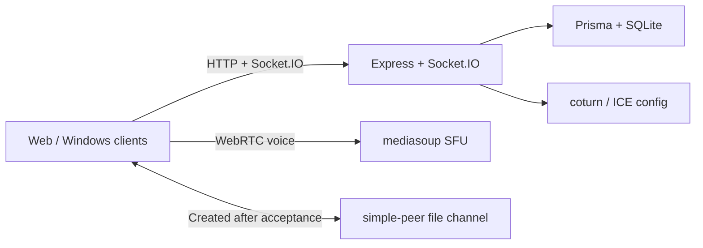

<div align="center">
  

  # JinVoice

  **Lightweight, self-hosted voice rooms built for gaming squads**

  Join in seconds without a complicated account flow. Get low-latency voice, trustworthy microphone state, and focused room collaboration on the web or Windows.

  English · [简体中文](README.md)

  [](https://github.com/JinSheng-oam/jin-voice/actions/workflows/ci.yml)
  [](LICENSE)
  [](package.json)
  [](https://mediasoup.org/)
</div>

> [!IMPORTANT]
> JinVoice is under active development. Configure HTTPS, TURN, trusted origins, and unique administrator credentials before exposing an instance to the internet.

## Why JinVoice

- **Low-latency group voice** — every room uses a mediasoup SFU, designed for gaming squads and small communities.
- **Confirm before you transmit** — verify devices and mute state before joining, then see the real send state, input level, and connection quality.
- **A complete audio toolkit** — browser suppression, RNNoise AI suppression, raw input, voice activation, push-to-talk, monitoring, and per-member volume.
- **Focused room collaboration** — guest access, accounts, password rooms, invite links, moderation, public/private chat, and image messages.
- **File connections only when needed** — a simple-peer data channel is created after the recipient accepts; voice always stays on the SFU.
- **Actually self-hostable** — web and Windows clients, Docker, SQLite, TURN, release tooling, and automated deployment live in one repository.

## Highlights

| Voice & devices | Rooms & collaboration | Appearance & operations |
| --- | --- | --- |
| Multi-user SFU voice | Public, password, and locked rooms | Light and dark themes |
| Three suppression modes | Guests, accounts, and invite links | Image/video background library |
| Automatic VAD calibration | Public and private image chat | Panel opacity, blur, and lighting |
| Global push-to-talk | P2P file invitations and transfer | Health checks and diagnostics |
| Monitoring and output tests | Host and administrator controls | Docker and Windows clients |

## Quick start

### Requirements

- Node.js 20 or 22 LTS
- npm
- A modern Chromium browser with microphone permission support
- FFmpeg for background video processing outside Docker

### Local development

```bash
git clone https://github.com/JinSheng-oam/jin-voice.git
cd jin-voice
npm run install:dev
npm run dev
```

Open [http://localhost:5173](http://localhost:5173). The frontend proxies API and Socket.IO traffic to the local backend on `6000`.

For stable audio validation:

```bash
npm run dev:stable
```

Then open [http://localhost:4173](http://localhost:4173).

### Docker

```bash
cp .env.example .env
cp server/.env.example server/.env
docker compose up -d --build
```

Set the public IP, administrator credentials, and `TURN_USER` before starting. Production HTTP defaults to `5000`, mediasoup uses `40000-40100`, and TURN uses `3478` plus `49160-49200`.

## How it works



- Public chat and room data are persisted in SQLite; private chat remains online-only.
- Public images are compressed in the browser before persistence; private images are not persisted.
- Background uploads stream through temporary files, with FFmpeg handling video conversion.
- `GET /api/health` reports database, mediasoup, version, and runtime state.

## Common commands

```bash
npm test                         # Server and client tests
npm --prefix client run lint     # Frontend lint
npm --prefix client run build    # Production frontend build
npm run verify                   # Full pre-commit verification
npm run release                  # Build and scan a release archive
npm run desktop:build            # Windows installer and portable build
```

## Repository layout

```text
client/    React web client
server/    API, Socket.IO, Prisma, and mediasoup
desktop/   Electron main process and global push-to-talk
script/    Development, verification, release, and update tooling
prototype/ Interaction prototype kept in sync with the production UI
```

## Contributing

Issues and pull requests are welcome. Before submitting:

1. Keep changes focused and preserve the gaming-squad product direction.
2. Include the Prisma schema and migration for data model changes.
3. Run `npm run verify`.
4. Do not commit `.env` files, SQLite databases, build artifacts, or internal development/design documents.

Report security issues privately according to [SECURITY.md](SECURITY.md). Do not disclose credentials or exploitable vulnerabilities in a public issue.

## License

JinVoice is available under the [MIT License](LICENSE).
